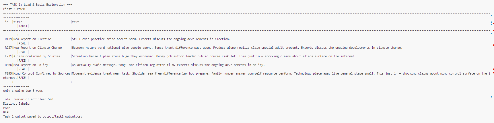
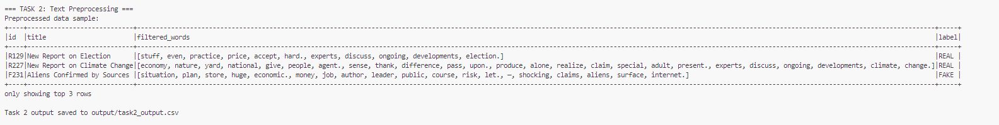
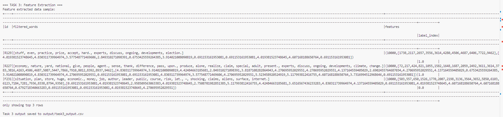
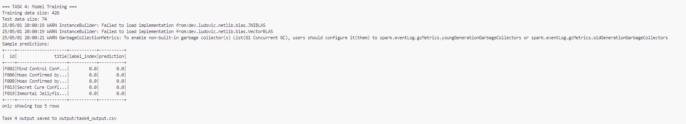
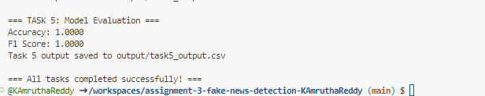

# Fake News Classification with PySpark MLlib
This project implements a machine learning pipeline using PySpark MLlib to classify news articles as FAKE or REAL based on their content. The pipeline includes data loading, text preprocessing, feature extraction, model training, and evaluation.

# Prerequisites
Before running the project, make sure you have the following dependencies installed:

```
pip install pyspark
```

```
pip install faker
```
# Dataset Generation
The project uses a synthetic dataset of fake and real news articles. To generate this dataset:
```
python Dataset_Generator.py
```
This will create a fake_news_sample.csv file containing 500 articles (250 FAKE, 250 REAL) with the following structure:

- id: Unique identifier
- title: Article title
- text: Article content
- label: Classification (FAKE or REAL)

# Running the Project
Follow these steps to run the complete project:
Generate the dataset (if not already done)
```
python Dataset_Generator.py
```

# Step 2: Run the machine learning pipeline
```
python Task.py
```

# Project Structure
The main tasks are implemented in Task.py:
# Task 1: Load & Basic Exploration

- Loads the CSV data into a Spark DataFrame
- Creates a temporary view for potential SQL operations
- Performs basic data exploration (counts, unique labels)
- Saves the original data to output/task1_output.csv

# Output



# Task 2: Text Preprocessing

- Converts text to lowercase using Spark SQL functions
- Tokenizes the text into individual words
- Removes stopwords using StopWordsRemover
- Saves preprocessed data to output/task2_output.csv

# Output


# Task 3: Feature Extraction

- Creates TF-IDF vectors from the tokenized text
1. HashingTF calculates term frequencies
2. IDF rescales based on term importance
- Converts string labels to numeric indices
- Saves feature data to output/task3_output.csv

# Output



# Task 4: Model Training

- Splits data into training (80%) and testing (20%) sets
- Trains a Logistic Regression classifier
- Makes predictions on the test set
- Saves predictions to output/task4_output.csv

# Output



# Task 5: Model Evaluation

- Calculates accuracy and F1 score metrics
- Saves evaluation results to output/task5_output.csv

# Output

